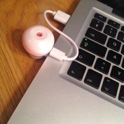

# Stinkee

**libstinkee** is a reverse-engineered C++ library to control
[Scentee](http://scentee.com) diffusers plugged into laptops or other non-iOS
devices.  I started working on it during a hackathon in May 2014 (Skills Matter
iOScon Hackathon, London) because the official Scentee SDK targeted iOS
platforms only and therefore an Apple developer license was required to play
with the diffuser.  This proof-of-concept doesn't offer all the functionalities
of the offical implementation: it only provides a unique call that releases a
scent and emits a colour.

## Build instructions

Stinkee depends on the cross-platform
[PortAudio](http://www.portaudio.com) library to transmit the encoded
sound signal, which activates the Scentee diffuser, to the audio output device.
Please refer to the PortAudio website for instructions on how to install it.
Then simply run

    make

to build the `libstinkee.a` static library and the `stinkeedemo` example
program.  (Note that the build has only been tested on Mac OS X so far.)

## Run the demo

1. Charge the diffuser with the USB cable.
2. Plug the diffuser firmly into the audio port of your computer.
3. Set the volume to the maximum.
4. Execute `stinkeedemo` to produce a puff, a yellow and a purple light!
